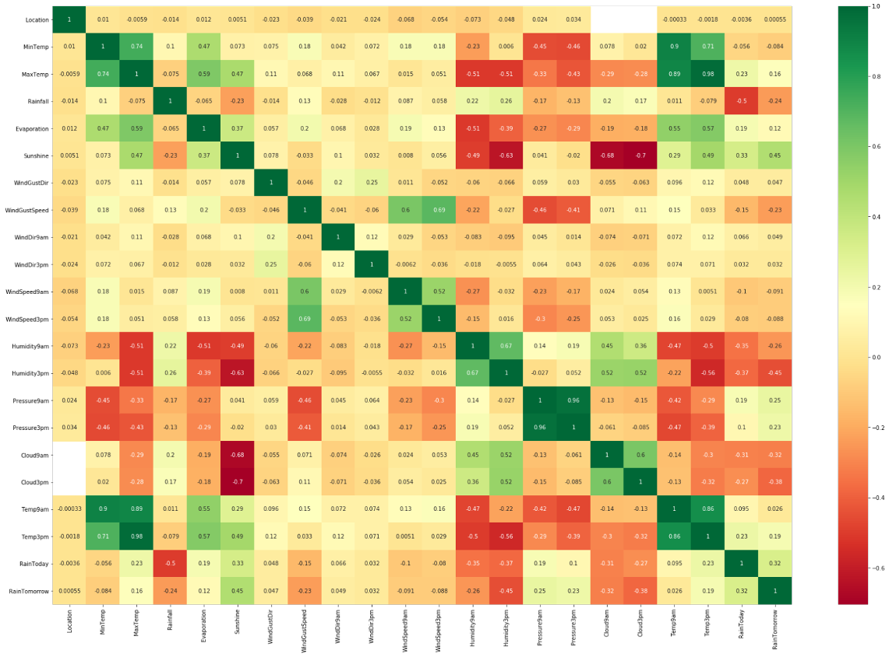
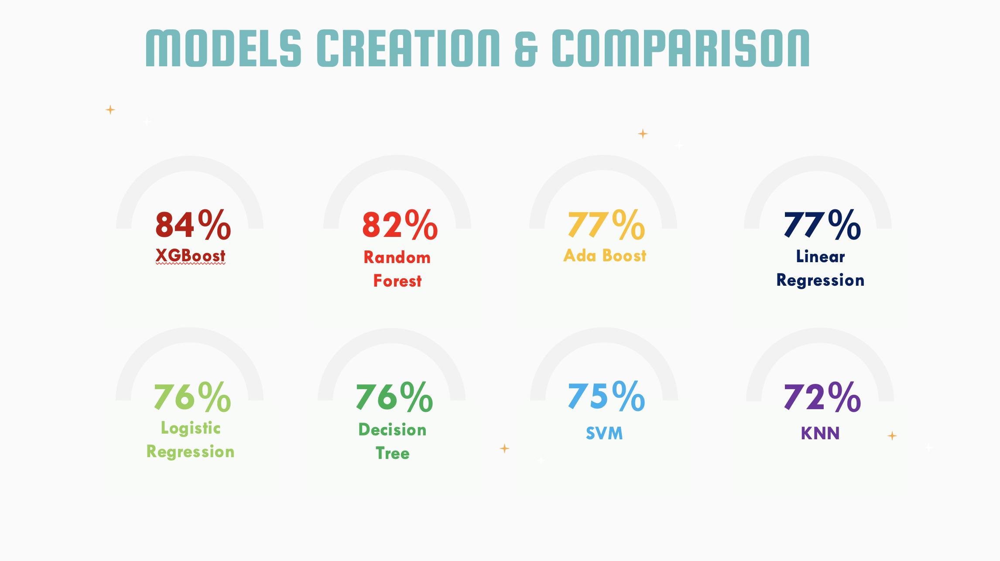
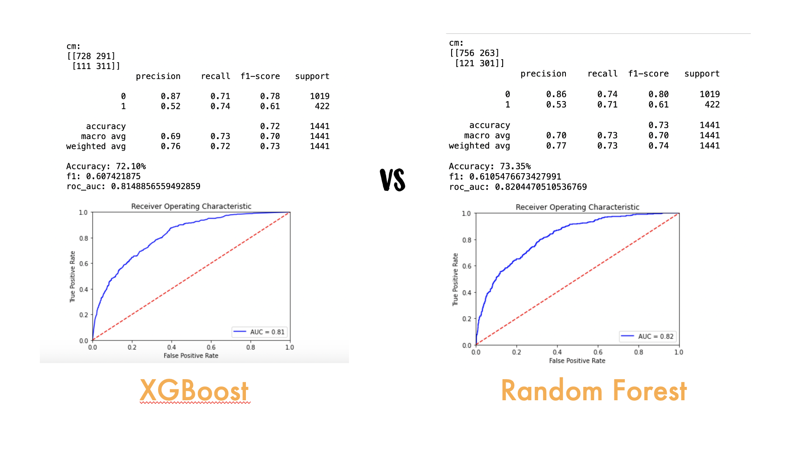
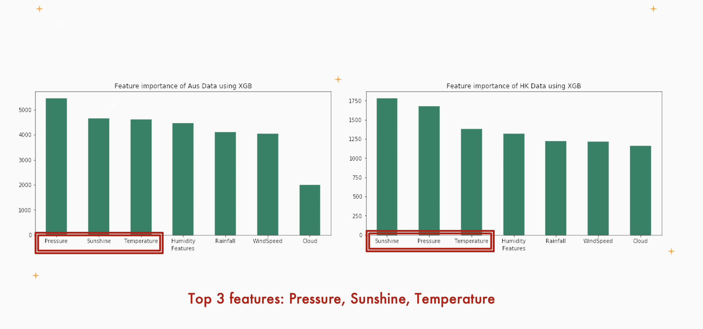

# Simple Machine Learning Project

## Project Overview
Occasionally we could observe that the weather prediction made by the authority is not always accurate thus bringing inconvenience and economic loss to the public. To further enhance the current weather forecasting system, we would like to find the most important features for raining prediction in order to provide and alternative solution for weather forecasting. In addition, by comparing the weather in Northern and Southern hemisphere, we wish to find interesting findings that might contributing to our project.

## Data Collection & Preprocessing

**Australian Weather**  

The <a href="https://www.kaggle.com/jsphyg/weather-dataset-rattle-package">Australia Rain Dataset</a> contains 10 years of daily weather observations from many locations across Australia, which scraped from the Bureau of Meteorology of Australia.

**Hong Kong Observatory**  
The Hong Kong Weather is scraped through Hong Kong Observatory by Dicky contains 7205 data of HK weather from 2008 to 2017

Data Preprocess:
  - Drop Risk_mm
  - Inpute Missing Values
  - Drop All the Categorical Volumns
  - Filter Out Common Columns For Both Dataset
  - Split Train/Test Data
  - Remove Outlier
  - Feature Scaling

## Models Evaluation 
We have adopted 8 machine learning models for training and predicting the possibility of raining for tomorrow.

 

## Conclusion & Future Improvements

  
  By comparing the feature importance among all the feature in the dataset, we have concluded the most important features are as following:
  
 

- Season isn’t an important feature
- Focus on top three features : Pressure, Temperature, Sunshine
- Feature engineering: feature cross with date/month column
- Quantitative Prediction: rainfall (mm)

